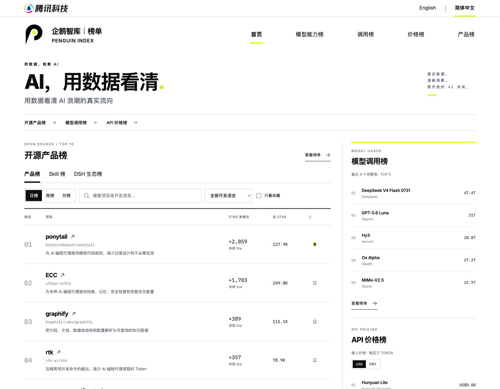
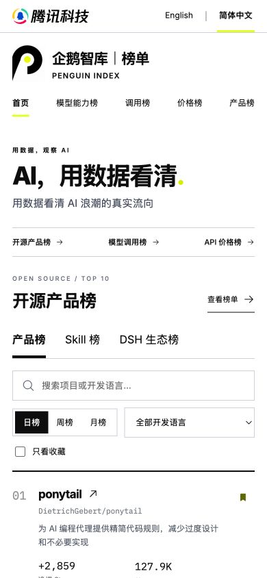
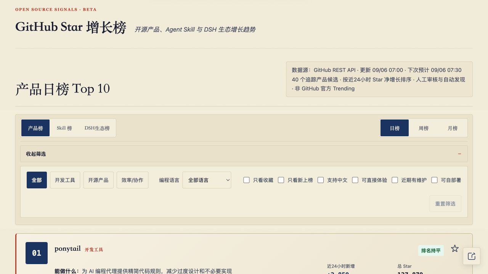
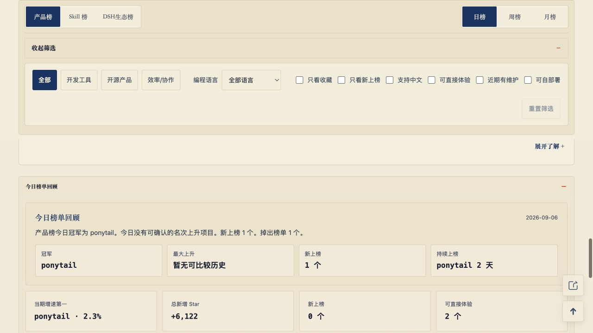
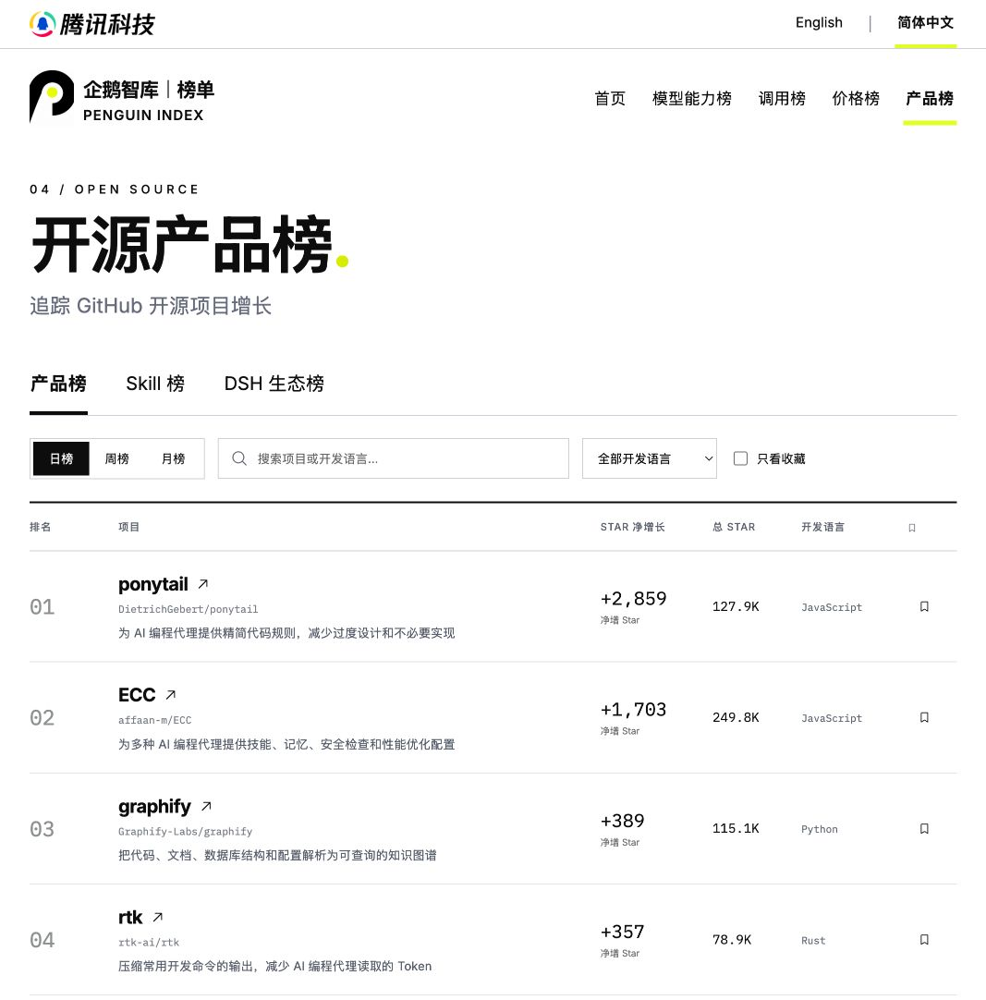
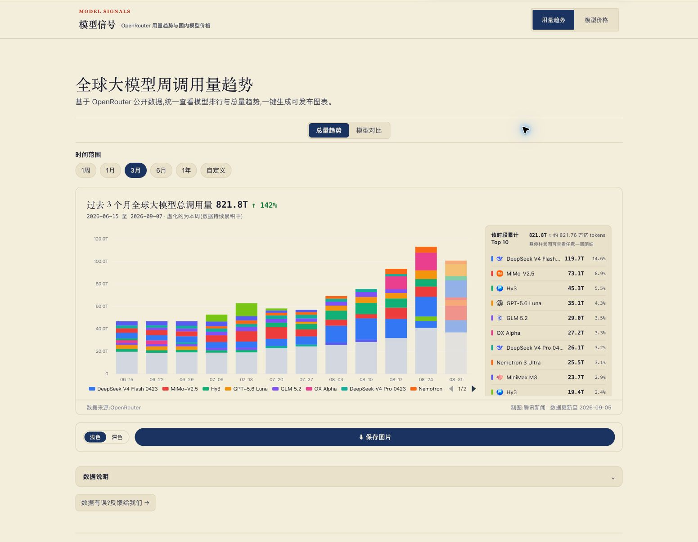
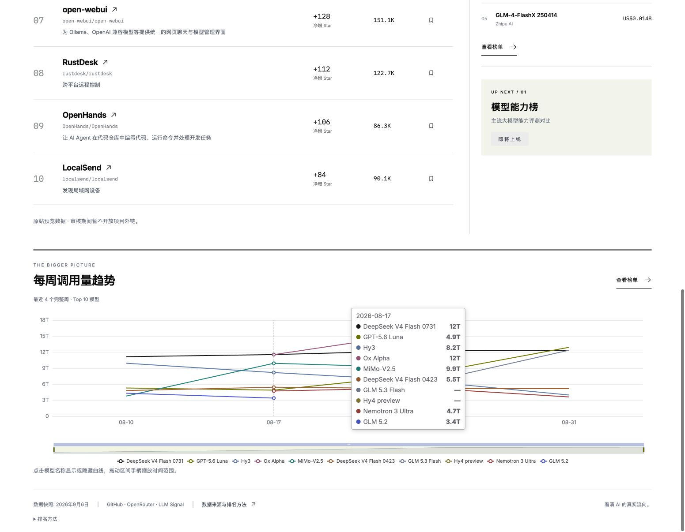
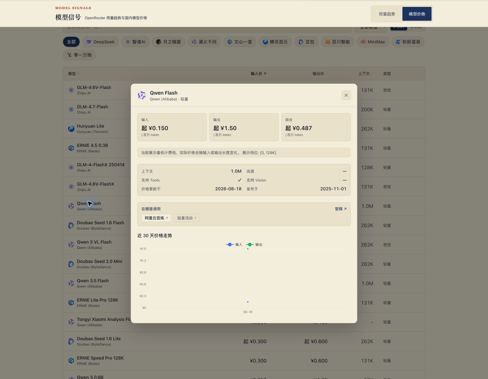
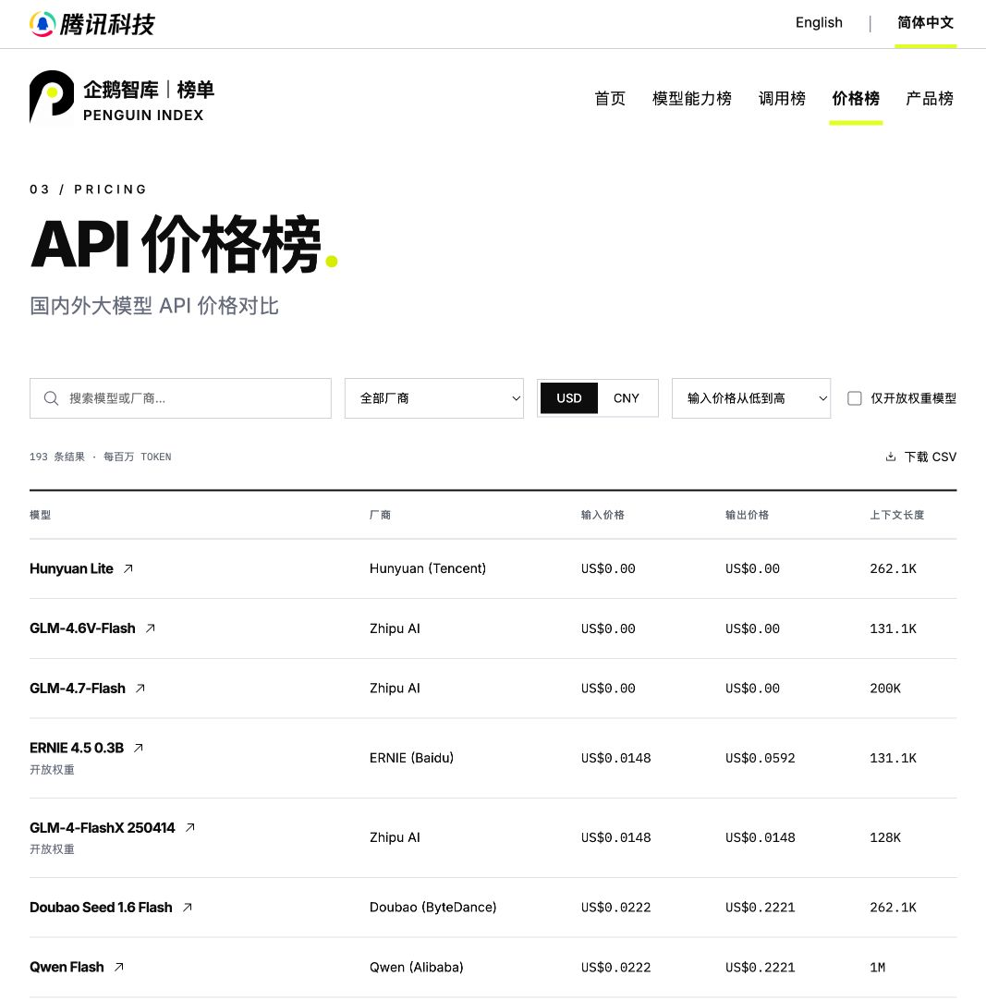

# 企鹅智库功能核对 — 2026-09-08

结论：新版未完整迁移原站功能。上一轮完成的是视觉重做和主要浏览交互，不能等同于功能全部完成。本次按用户补充要求，将首页从导航目录改为可浏览榜单；其余差异仍明确保留为待补项。

对照来源：[原站](https://kejunzheng.github.io/penguin-ranking-preview/)；[新版](https://yonge6.github.io/penguin-index/?lang=zh)。原站内嵌调用榜和价格榜在 Chrome 实测，新版以公开站点、当前代码和本地修改后页面交叉核对。以下截图均来自本次核对，历史设计 QA 不作为功能齐全的证据。

## 1. 打开首页并浏览内容 — 本次已补齐内容入口

原站打开即可看实际项目榜单。新版此前首页只有导航卡片，存在额外点击成本。

本次改为：产品 / Skill / DSH 三频道、日 / 周 / 月范围、Top 10 项目、介绍、Star 增长与总量、搜索、语言筛选、收藏、项目详情，均可在首页操作。侧栏展示最近 4 个完整周的调用量 Top 5 和输入价格最低的 5 个模型，支持美元 / 人民币与价格详情。下方展示真实快照驱动的用量趋势图。保留能力榜即将上线状态。

桌面为主榜单加侧栏，手机首页项目使用纵向布局，无需横向滚动查看 Star 数。中英切换保留频道和周期。

## 2. 筛选开源榜单、查看详情与回顾 — 部分完成

| 功能 | 当前状态 | 原站差异与影响 |
| --- | --- | --- |
| 产品 / Skill / DSH、日 / 周 / 月榜 | 已有 | 缺失月榜基线时明确显示积累中 |
| Top 10、Star 净增长与总 Star、收藏、开发语言筛选 | 已有 | 搜索为新版新增 |
| 分类筛选 | 缺失，P1 | 原站支持开发工具、开源产品、效率 / 协作 |
| 五项精细筛选 | 缺失，P1 | 只看新上榜、支持中文、可直接体验、近期有维护、可自部署 |
| 项目详细信息 | 简化，P1 | 缺少完整能力、适用人群、典型用途、上手难度、中文支持、平台和部署方式等内容 |
| 项目历史与编辑信息 | 缺失，P1 | 首次上榜、连续上榜天数、历史最佳排名、最近推送、编辑点评未展示 |
| 排名变化 / 增长率 | 缺失，P2 | 新版仅展示名次、增长绝对数和总量 |
| 今日榜单回顾 | 缺失，P1 | 缺少榜首、涨幅最大、新上榜、连续霸榜，以及总增长等汇总 |
| 分享当前榜单 / 返回顶部入口 | 缺失，P2 | 原站存在这两个入口；分享的外部投递结果未验证 |
| 权利人纠错入口与完整声明 | 缺失 / 简化，P2 | 原站有纠错表单、免责声明和许可提示，新版只保留来源与简化方法说明 |

原站筛选证据：

原站回顾证据：

新版当前筛选与项目列表：

## 3. 查看模型用量与比较趋势 — 本次已恢复主要交互

- 一周展示上个完整周横向柱状图；长周期展示平台总量堆叠柱状图，包含其他模型和标淡的未完整当周。
- 原站 1周 / 1月 / 3月 / 6月 / 1年 / 自定义周期已恢复；完整周增长率、平台总量和份额由快照计算。
- 模型比较支持搜索、厂商筛选、添加 / 移除、最多10个、恢复默认。缺失数据保留断点。
- 图表浅色 / 深色和 PNG 保存可用，另有排名 CSV 导出。模型品牌标志已添加。
- 独立反馈入口仍未迁移。

原站总量图与控制项：

本次首页保留的用量图和提示浮层：

两版聚合范围、时间范围和模型标识口径有差异，不能直接用显示总量不同推断计算错误。未对上游平台数据真实性作独立审计。

## 4. 筛选模型价格并查看详情 — 部分完成

| 功能 | 当前状态 | 原站差异与影响 |
| --- | --- | --- |
| 193 个模型、搜索、厂商筛选、CNY / USD、基本价格与上下文 | 已有 | 新版另有开放权重过滤和 CSV 导出 |
| 模型类别筛选和类别列 | 缺失，P1 | 无法按推理、视觉、代码等用途定位 |
| 双向排序 | 简化，P2 | 新版仅输入升序、输出升序、上下文降序；缺模型名和各列反向排序 |
| 分页与每页条数 | 缺失，P2 | 原站支持 20 / 50 / 100 / 200；新版一次显示全部结果 |
| 价格详情 | 主要功能已恢复 | 综合价格、阶梯区间、发布日期已展示；列表起价标记仍待补 |
| 官方网站 / 官方 API / 第三方调用入口 | 已恢复 | 沿用原站厂商级入口，平台内具体模型可用性须自行确认 |
| 最近 30 天价格趋势 | 已恢复 | 按价格快照日期回看，仅展示已记录观测 |

原站详情中的价格区间、调用入口和历史趋势：

新版价格列表：

## 5. 数据更新、需求边界和可访问性 — 仍有限制

- 新版使用仓库打包 JSON 快照，未建立自动数据同步流程。部署工作流只构建和发布现有快照。公开页面的成功访问不意味着数据会持续自动更新。
- 当前项目快照日期为 2026-09-06，调用数据更新日期为 2026-09-07，价格快照更新日期为 2026-08-18。价格不是实时报价。
- 能力榜“即将上线”是正式需求允许的状态，不计为遗漏。
- 项目卡片小型 Star 曲线按正式需求移除，不计为遗漏。调用榜主图不能删，本次首页也显示了主图摘要。
- 原站预览也禁用项目外链，不能把新版的同样限制误记为回归。价格详情中的官方调用链接已在本次迁移。
- 中英 UI、重新设计的企鹅标记、腾讯科技官方标志和来源说明已实现。
- 手机首页视觉检查确认 390px 页面无横向溢出。小号灰色辅助文案、图表颜色区分和触控目标仍有可访问性优化空间；未完成屏幕阅读器、对比度仪器测量或真实手机测试，不能宣称完整 WCAG 合规。
- 原站嵌入页面在应用内浏览器未稳定加载，改用 Chrome 成功操作。没有原站服务器任务和数据采集流程的后台访问证据，不推断其自动更新机制。

## 优先补齐顺序

剩余工作为产品精细筛选、完整详情和榜单回顾，价格类别、双向排序、分页、列表起价标记，以及数据自动同步、反馈与分享入口。

## 本次首页验证

- 日榜、周榜和月榜状态、Skill 和 DSH 切换；DSH 月榜基线积累状态。
- 搜索 ECC、收藏、只看收藏、打开 / 关闭详情；测试收藏操作已撤回。
- 中英切换保持 Skill 周榜；首页价格数据不受项目搜索影响。
- CNY 切换与 ERNIE 价格详情，手机价格区块锚点定位。
- 中英手机首页实测 390px 宽无页面横向溢出；桌面截图与所选视觉方案同轮比较。
- 趋势图绘制成功，鼠标提示显示具体周与模型用量。
- 自动数据测试与生产构建通过；线上发布结果另见 design-qa.md 的本次验收追加。

本报告为功能与交互对照，不是对全部浏览器、全部模型数值或后台服务的穷尽验证。当前仍不应标记“原站功能全部完成”。

## 2026-09-09 — 蓝色主题与价格榜范围

新增全球大模型 / 中国大模型切换，支持各自的搜索、厂商筛选、币种、排序、详情和 CSV。全球数据为 2026-09-09 从 https://openrouter.ai/api/v1/models 获取的426个具有有效文本输入/输出价格的模型快照，包括该平台上的中国模型；中国数据沿用原站193个活动模型的厂商价格快照。全局模型价格按每 Token 转为每百万 Token；人民币按原站存储汇率折算，明确标注参考价。OpenRouter 未提供的权重许可、发布日期、历史价格保持未提供；不把 hugging_face_id 推断为开源许可。全球尚未建立历史积累或自动同步。品牌未知标志用中性图形，不虚构商标。
